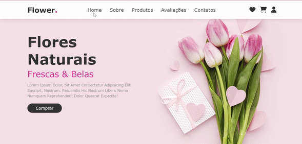

<h1 align="center">Projeto: Floricultura</h1>
<h2 align="center">Status do projeto: Concluído ✅</h2>

<h2 align="center">Aprendizados nesse projeto 🎯</h2>

Trata-se de uma página modelo de E-commerce para um floricultura. 

Onde foi possível usar as funcionalidades Flex (grow, shrink e basis) e a propriedade mix-blend-mode.

 O objetivo é continuar aprofundando os conhecimentos em HTML5, CSS3 e responsividade

<h2 align="center">Tecnologias utilizadas 🛠</h2> 

<h2 align="center">Deploy 👨🏽‍💻</h2>
<a href="https://lilian-rangel.github.io/Projeto-Floricultura/" target="_blank">Link para o projeto</a>

<h2 align="center">Demo do projeto </h2>
 

<h2 align="center"> Contributors 💻</h2>
<table align="center">
<tbody>
<tr>
<td align="center">
 <b>Lílian Rangel</b>
 

</td>

</tr>
</tbody>
</table>
